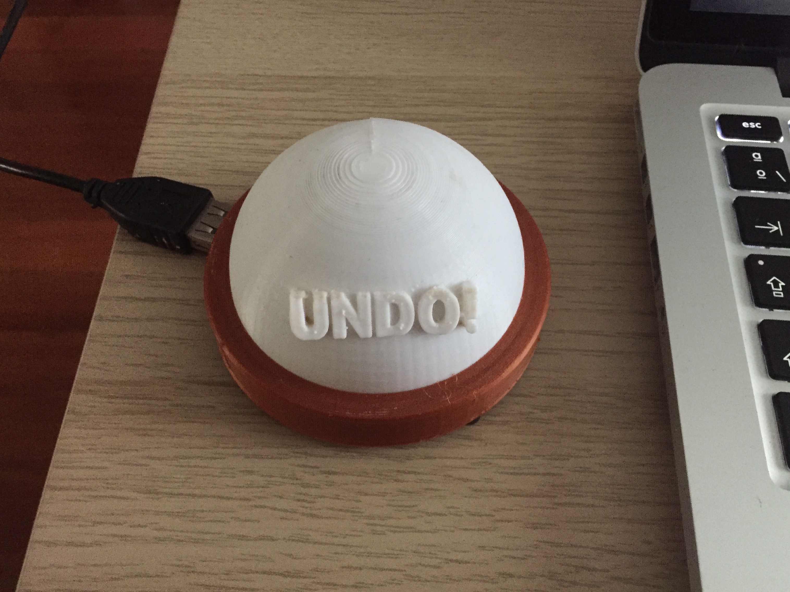
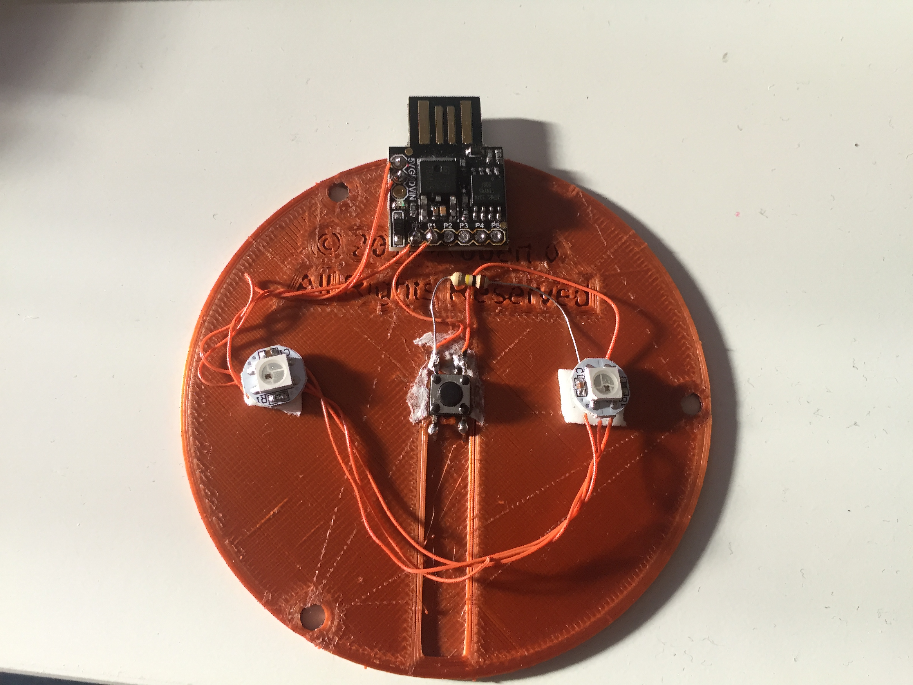
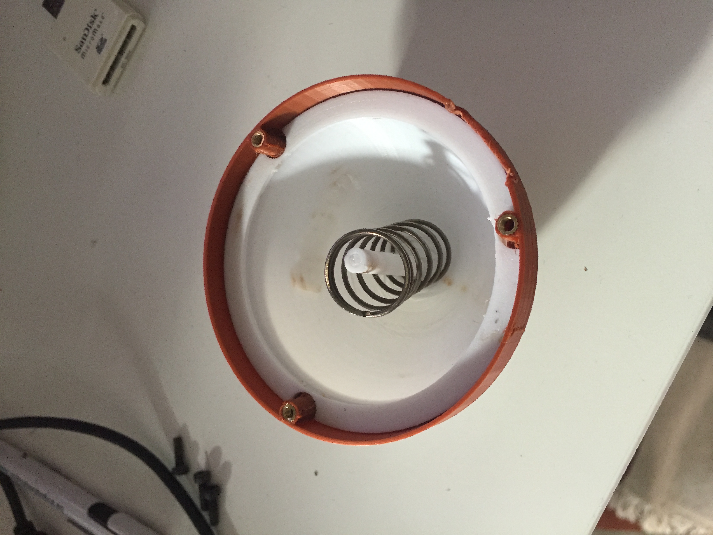
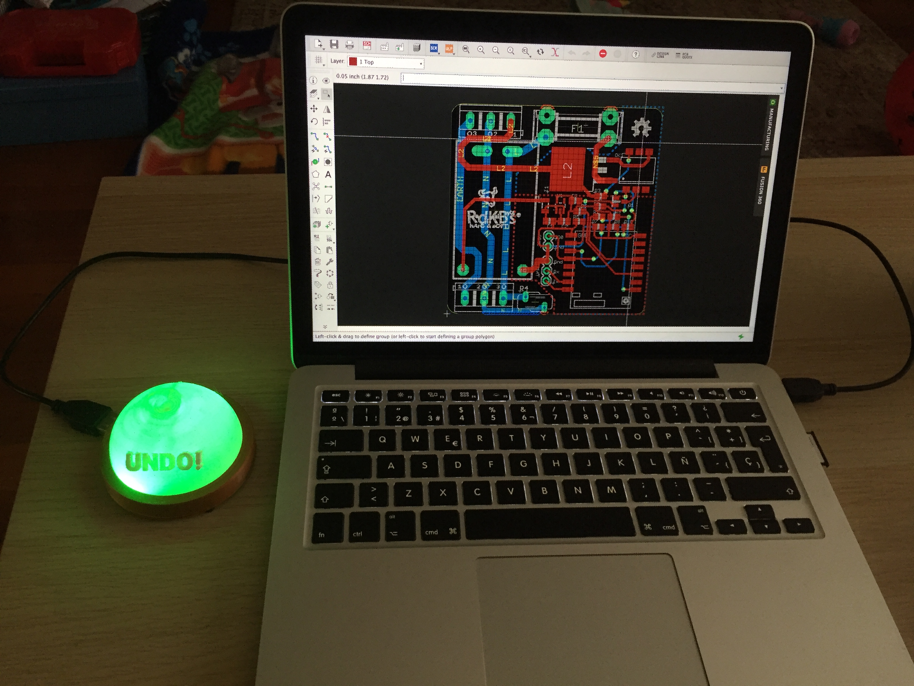
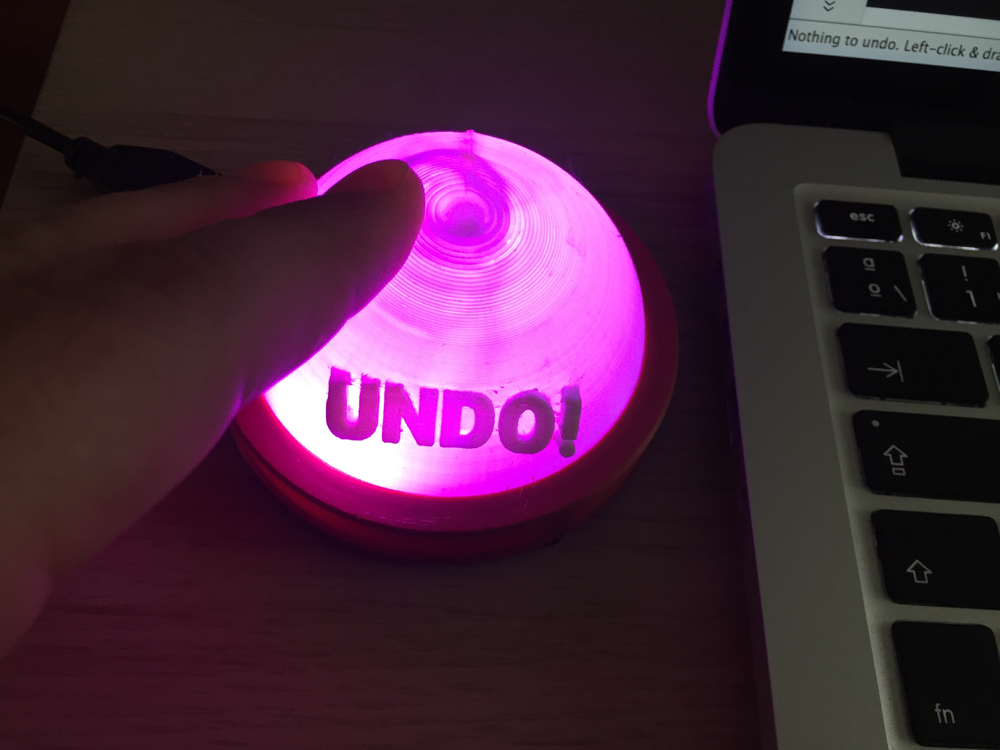
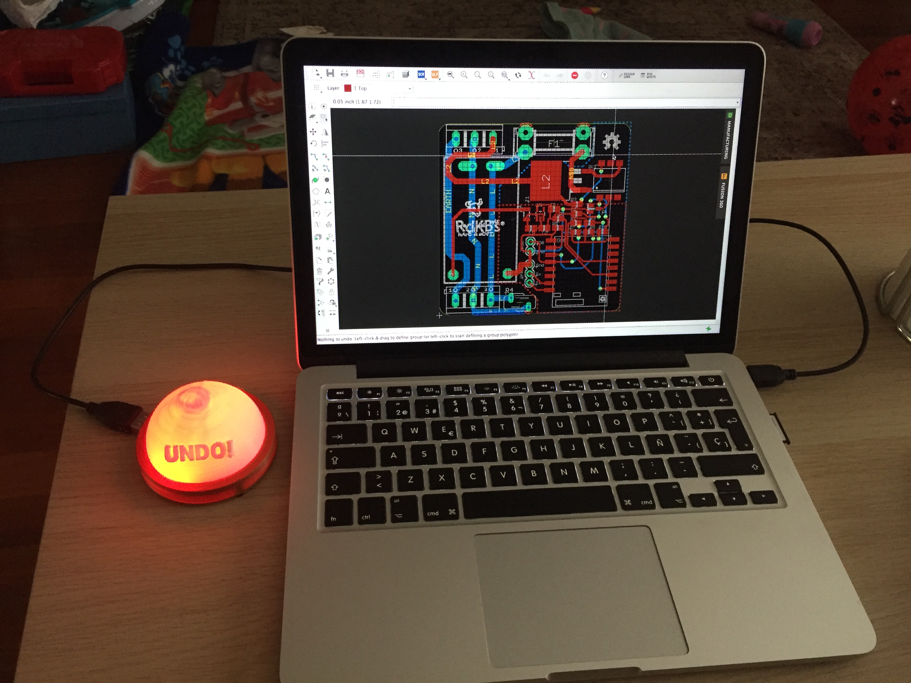
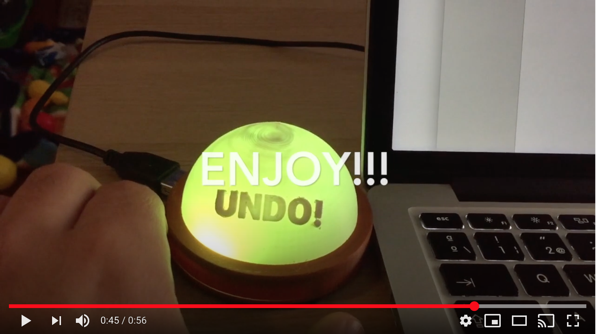

# UNDO Big Button

Hello there!

This is a fun project made at Covid-19 confinament from trash. 
Sometimes we use CTRL+Z or CMD+Z to UNDO.

If you use a lot of Undo shortcuts maybe your software skills are bad or you need put more attention at your work.

This Big Undo Button starts in green color and goes to red every time you push it.

You can feel how satisfactory is push it and obtain an Undo command... you can strike it, hugh it, push it, punch it... you'll love it, but every time you push it, Undo Button change more red and you will feel a noob.

If you don't push it for a while ( 1 minute ), Undo Button shifts color less red and every minute returns to green.

 

It's simple:

* A big button 3D printed at home
* Attiny85 PCB (Digispark clone)
* 2xWS2812 RGB led
* Microswitch
* Old spring
* Some double side tape

## Electronics

The WS2812 are conected serially (Attiny_Pin0 -> Din1 -> Dout1 -> Din2)

Microswitch is conected with a GND pulldown resistor to Attiny_Pin1

## 3D printed parts

I used a [Big button](https://www.thingiverse.com/thing:379920) model from [rmd6502](https://www.thingiverse.com/rmd6502/about) thingiverse user whit some modifications at cap button file adding 3D UNDO text over it.

The file is [here](pulsador.stl) in stl format.

You can mount button with a rubbish spring or without it. I had one in my trash components box :)

## Software
Only need to program attiny with your Arduino environment. 

Don't forget:

* [Adafruit Neopixel Library](https://github.com/adafruit/Adafruit_NeoPixel)
* [Adafruit Trinket Keyboard Library](
https://github.com/adafruit/Adafruit-Trinket-USB/tree/master/TrinketKeyboard)
* Uncomment line (about 72-75) to use Undo Button on MAC or Windows-PC (COMMAND+Z or CONTROL+Z)
* _interval definition is the time interval without pulsations to shift a level from red to green. By default is 60 seconds.

Default color when you push Undo Button is purple **RGB(250,0,250)**

If you put button in red color maybe you are not paying enough attention to what you do :p

ENJOY IT...

2020 Alfredo Prado

@radikalbytes
